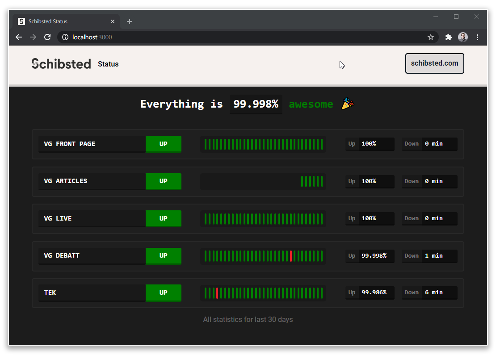

# Pingdom Status Page

A status page that shows ~off~ your current and historical uptime from [Pingdom](https://pingdom.com).
See it in action at [vgstatus.no](https://vgstatus.no).

<p align="center">
  
</p>

## Getting started

First, set `PINGDOM_API_KEY` to your [Pingdom API key](https://my.pingdom.com/app/api-tokens). To 
start the server, run `$ yarn dev` for development or `$ yarn start` for production. Then open
[http://localhost:3000](http://localhost:3000) with your browser to see it.

To sync with Pingdom, run `$ yarn run update`.

## Configuration

Configure your checks in `config.json`:

```javascript
{
  "checks": [
    {
      "id": 4574685, // The check ID on Pingdom (find it by opening it in Pingdom and looking in the URL)
      "name": "VG Front page" // Whatever you want it to be listed as on your status page
    },
    {
      "id": 6420183,
      "name": "VG Articles"
    },
    ...
  ]
}
```

## Frequently Asked Questions (that we made up)

#### How can we customize it?

Just change the code. That's right. That way, it's infinitely flexible, and that's what we would
want for our status page.  If you want to make it easy to get updates from us, we recommend making
a fork and branching out. Then all you have to do is `git pull` and fix any merge conflicts you might
have from your changes.

#### There are a lot of open source status pages. How is this different?

There are a lot of open source status pages out there, but they're mostly manually updated
and can't show ~off~ your historical uptime. We could only find one other open source
status page ([Statping](https://github.com/statping/statping)) which actually measures uptime,
but if you're already using Pingdom then this is simpler.

## Deployment

Pingdom Status Page only needs NodeJS to run. It's important to us that it runs anywhere, so
it's easy to set up in an environment that preferably _isn't the one you're monitoring_.

#### systemd

Here's a handy systemd file to run it:

```
[Unit]
Description=Pingdom Status Page

[Service]
ExecStart=/usr/bin/yarn start -p 80
StandardOutput=file:/path/to/your/stdout.log
StandardError=file:/path/to/your/stderr.log
Restart=always
Environment=PATH=/usr/bin:/usr/local/bin
WorkingDirectory=/path/to/the/code

[Install]
WantedBy=multi-user.target
```

#### crontab

Here's a handy crontab to sync with Pingdom every minute and log it to a file:

```crontab
* * * * * (cd /path/to/the/code && . /path/to/the/code/.envrc && /usr/bin/yarn update) > /path/to/your/log 2>&1
```
